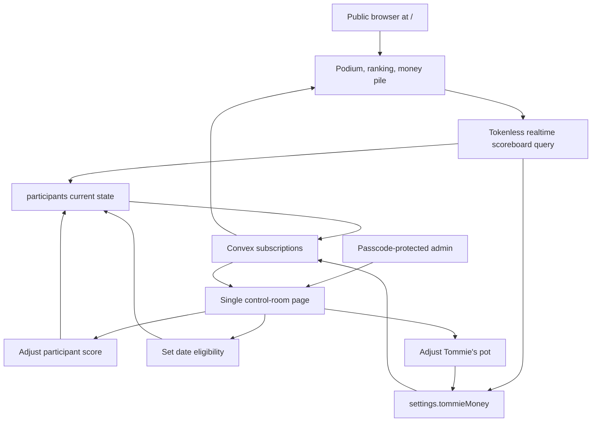
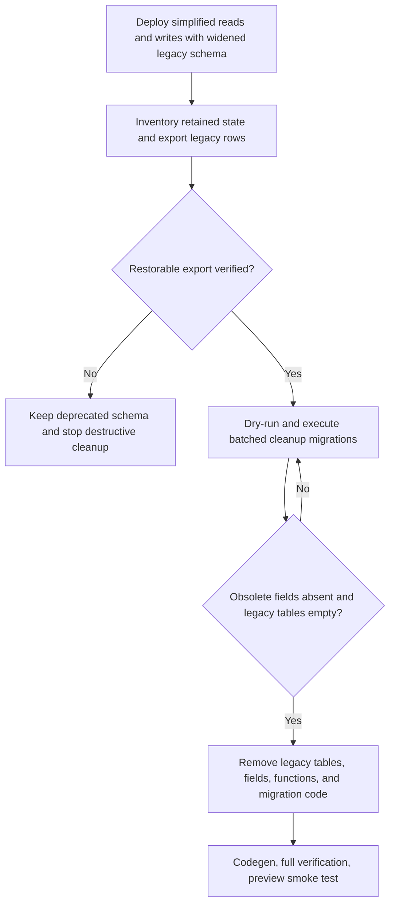

# refactor: Simplify Tommie tracker into a live scoreboard

## Goal Capsule

| Field | Value |
|---|---|
| Objective | Reduce the implemented tracker to a public realtime scoreboard and a three-action admin control room. |
| Public experience | `/` shows a top-three podium, the complete ranking, date eligibility, and Tommie's exact money total with a growing money-pile visualization. |
| Admin authority | A passcode-protected admin can adjust a participant's score, set date eligibility, and adjust Tommie's pot. |
| Retained data | Existing participant names, photos, active state, scores, date flags, admin sessions, and Tommie's current balance survive the refactor. |
| Stop conditions | Do not calculate game results, model cards or teams, manage dates as workflows, expose participant-specific QR views, or add participant setup to the live admin surface. |

---

## Product Contract

### Summary

The app becomes a visual, public event scoreboard. All quiz scoring and physical card handling happen outside the app. Convex retains the participant display and competition state, admin sessions, and Tommie's current balance needed for the public scoreboard and protected admin controls.

### Problem Frame

The current implementation encodes card ranks, draw obligations, quiz and mini-game rewards, team membership, date task lifecycle, payout configuration, QR access, and event history. Those mechanisms duplicate decisions made physically during the event and make the interface slower to operate. The remaining product should make the competition and Tommie's generated money instantly legible without asking the app to understand the game.

### Actors

- A1. Admin host: logs in and applies score, date-eligibility, and money adjustments.
- A2. Audience member: opens the public scoreboard on a phone or shared display and watches it update live.

### Requirements

#### Public scoreboard

- R1. `/` must be a public, tokenless realtime scoreboard backed by Convex.
- R2. The three highest-ranked active participants must appear in a visually distinct podium with first place centered and elevated on wider screens.
- R3. The complete active-participant ranking must appear below the podium using the same deterministic order.
- R4. Podium and ranking entries must show participant name, score, available photo, and whether the participant may have a date with Tommie.
- R5. Equal scores must remain visibly equal while a stable `createdAt`, then `_id`, tiebreak prevents participants from changing positions between renders.
- R6. The scoreboard must handle zero, one, or two active participants without inventing podium entries.
- R7. Tommie's exact localized EUR total must accompany a decorative money pile that grows in capped visual tiers and remains usable at zero or very large totals.
- R8. Score, date eligibility, participant photo, and money changes must update without a page refresh.

#### Admin control room

- R9. Existing passcode/session protection must remain on all admin mutations.
- R10. The admin must be able to adjust one participant's score by a finite, non-zero integer.
- R11. The admin must be able to set a participant's date eligibility to an explicit boolean state.
- R12. The admin must be able to adjust Tommie's pot by a finite, non-zero integer.
- R13. Negative adjustments may correct mistakes, but neither a participant score nor the money pot may fall below zero.
- R14. Each form must prevent duplicate submission, show an inline failure, and rely on the realtime result as confirmation.

#### Simplification and continuity

- R15. Existing participant records, stored photos, scores, date flags, active state, and current money balance must survive deployment.
- R16. The app must remove card scoring, card draws, draw obligations, teams, quiz and mini-game reward calculation, date task lifecycle, payout configuration, participant QR tokens, participant-specific views, and public event history.
- R17. Legacy `/p/[token]` URLs must redirect to `/` during the transition instead of becoming dead links.
- R18. Participant creation, editing, photo upload, and activation are not part of the event-day UI; the event roster is prepared before this refactor or maintained directly through Convex outside the app.

### Key Flows

- F1. Audience watches the live scoreboard
  - **Trigger:** An audience member opens `/` directly or follows an old QR link.
  - **Actors:** A2
  - **Steps:** The app subscribes to the tokenless scoreboard query, ranks active participants once through the shared ranking helper, and renders the podium, full ranking, date states, exact money total, and money pile.
  - **Outcome:** The audience sees a single live view with no login or participant-specific context.
  - **Covers:** R1-R8, R17

- F2. Admin adjusts a participant score
  - **Trigger:** A score is determined outside the app.
  - **Actors:** A1
  - **Steps:** The admin selects a participant, enters a signed delta, submits once, and the mutation validates and applies the new total transactionally.
  - **Outcome:** Admin and public views show the updated score and ranking in realtime.
  - **Covers:** R9, R10, R13, R14

- F3. Admin sets date eligibility
  - **Trigger:** The physical game determines that a participant gains or loses date permission.
  - **Actors:** A1
  - **Steps:** The admin chooses the desired eligible/ineligible state; the mutation writes that exact boolean rather than toggling server state.
  - **Outcome:** Retried requests are idempotent and every live scoreboard entry shows the new state.
  - **Covers:** R9, R11, R14

- F4. Admin adjusts Tommie's pot
  - **Trigger:** Money is earned or a previous money entry needs correction.
  - **Actors:** A1
  - **Steps:** The admin enters a signed EUR delta and submits; the mutation validates the resulting balance and updates the single settings record.
  - **Outcome:** The exact total and capped money pile update in realtime.
  - **Covers:** R7-R9, R12-R14

### Acceptance Examples

- AE1. Stable top three on equal scores
  - **Given:** Noor and Lisa both have 40 points and Noor was created first.
  - **When:** The scoreboard ranks participants repeatedly after unrelated realtime updates.
  - **Then:** Both still show 40 points and Noor stays ahead of Lisa without flicker or reordering.
  - **Covers:** R2, R3, R5

- AE2. Short podium
  - **Given:** Only two participants are active.
  - **When:** The public scoreboard loads.
  - **Then:** It renders those two real contenders and no fabricated third participant.
  - **Covers:** R6

- AE3. Score correction cannot create a negative total
  - **Given:** A participant has 5 points.
  - **When:** The admin submits a score adjustment of `-6`.
  - **Then:** Convex rejects the mutation, the displayed score stays 5, and the form shows the error.
  - **Covers:** R10, R13, R14

- AE4. Date state is idempotent
  - **Given:** A participant is already date-eligible.
  - **When:** The admin request to set eligibility to `true` is retried.
  - **Then:** The participant remains eligible and no inverse toggle occurs.
  - **Covers:** R11, R14

- AE5. Money pile remains bounded
  - **Given:** Tommie's pot is EUR 100,000.
  - **When:** The scoreboard renders the money section.
  - **Then:** The exact EUR 100,000 total is visible while the decorative pile stays at its maximum visual tier and uses a bounded number of DOM elements.
  - **Covers:** R7

### Scope Boundaries

In scope:

- Reuse the current participant records and stored photos as display data.
- Preserve admin passcode login and session expiry.
- Permit signed adjustments for lightweight corrections without an undo subsystem.
- Update event-day and deployment documentation to describe the reduced app.

Outside this product's identity:

- Card or deck representation, random draws, and card-to-score rules.
- Quiz, team, mini-game, placement, or reward calculations.
- Date tasks, date outcomes, or automated rewards.
- Money targets, payout categories, financial settlement, or payment processing.
- Participant accounts, QR authorization, personalized participant views, and public activity history.
- Participant roster and photo management during the event.

### Assumptions

- The intended event roster and photos exist in Convex before the participant-management UI is removed.
- Scores and money are whole-number units; decimal inputs are invalid.
- Tommie remains the canonical product name even where event participants refer to Thomas.
- The public nature of scores, photos, and date eligibility is acceptable for this private event app.

### Sources

- Previous implementation plan: `docs/plans/tommie-tracker-webapp-plan.md`
- Current application: `src/app`, `src/components`, and `convex`
- Project-specific Convex rules: `convex/_generated/ai/guidelines.md`

---

## Planning Contract

### Key Technical Decisions

- KTD1. Make `/` the canonical public scoreboard. A tokenless bounded Convex query returns every active participant needed for this explicitly complete event roster plus the single money record; admin mutations remain session-protected.
- KTD2. Keep only current state in the long-term model. `participants` retains display and competition state, `adminSessions` retains admin access, and `settings` retains `tommieMoney`; legacy rule and audit tables are removed after their data is safely retired.
- KTD3. Express score and money changes as transactional deltas. Each Convex mutation reads the current document, validates the proposed result, and patches it in one transaction so concurrent admin submissions cannot silently overwrite each other.
- KTD4. Set date eligibility to an explicit desired value. This is idempotent across retries and safer than a blind toggle.
- KTD5. Derive all rankings and money-pile tiers through pure TypeScript helpers shared by the UI and unit tests. The leaderboard uses score descending, then `createdAt`, then `_id`; the pile uses a fixed EUR-per-tier scale and a hard visual cap.
- KTD6. Build the podium and pile with existing React, Tailwind, shadcn/Base UI primitives, and CSS. Do not introduce a charting, animation, or illustration dependency; the exact text remains authoritative and decorative motion respects reduced-motion preferences.
- KTD7. Use a staged Convex widen-migrate-narrow rollout. The simplified code ships while legacy schema remains valid, batched migrations remove obsolete fields and rows, verification proves cleanup, and only then does the schema narrow.
- KTD8. Remove participant setup from the event-day UI while preserving underlying participants and storage objects. Old QR routes redirect to `/`; stored photos continue to resolve through `ctx.storage.getUrl()`.

### High-Level Technical Design

### Migration and Rollout Strategy

1. Widen `settings.tommieTarget` and `settings.defaultPayouts` to optional while legacy documents and tables remain valid. Ship the new public query and narrow admin mutations without deleting stored data.
2. Record a pre-migration inventory keyed by participant ID, including participant count, names, photo storage IDs, active state, scores, date flags, the singleton settings ID, and `tommieMoney`. Create a restorable export of legacy rows before any destructive cleanup; do not delete storage objects.
3. Add `@convex-dev/migrations` temporarily. Dry-run, execute, and monitor idempotent migrations that clear `participants.currentTeamId`, clear obsolete settings fields, then delete dependent rows from `participantTokens`, `drawObligations`, `activities`, `events`, and finally `teams` in resumable batches.
4. Verify the retained-state inventory matches exactly, the settings key still resolves to one document, deprecated tables are empty, and deprecated fields are absent. Keep the previous application deployment available until these checks pass.
5. Narrow `convex/schema.ts`, remove legacy backend modules and generated API references, regenerate Convex types, and remove the temporary migrations component only after the rollback window closes. If no restorable export can be produced, stop after the reversible code/UI cutover and leave empty deprecated tables in the schema for later cleanup.

### Risks and Mitigations

- Removing participant setup can strand an incomplete roster. Before cutover, verify every intended participant is active and has the desired name/photo; document Convex Dashboard as the out-of-band maintenance route.
- Removing schema fields or tables before their stored data is cleared causes Convex deployment validation to fail. Keep the rollout multi-deploy and gate narrowing on explicit migration verification.
- Destructive cleanup can erase the only explanation for legacy totals. Require a restorable export and retained-state inventory before deletion; the simplified UI can ship while physical table removal waits.
- Deleting teams before clearing participant references creates dangling IDs during the migration window. Clear `currentTeamId` first and delete dependent legacy rows before deleting teams.
- A decorative pile can create excessive DOM or obscure the actual amount. Cap visual layers, keep exact localized EUR text prominent, and test zero and large totals.
- Podium layout can become confusing on small screens. Keep semantic DOM order as ranks 1, 2, 3, use CSS placement for the desktop 2-1-3 presentation, and preserve rank labels at every breakpoint.
- Tokenless access exposes the whole scoreboard. Keep mutation authorization unchanged and document the public-read posture as a deliberate private-event tradeoff.

---

## Implementation Units

### U1. Minimal Convex state and API compatibility layer

- **Goal:** Introduce the reduced public query and three admin mutations without invalidating existing Convex data.
- **Requirements:** R1, R8-R16
- **Dependencies:** None
- **Files:** `convex/schema.ts`, `convex/scoreboard.ts`, `convex/trackerAdmin.ts`, `convex/adminAuth.ts`, `convex/authTokens.ts` (delete after auth split), `convex/settings.ts`, `convex/participants.ts`, `convex/tracker.test.ts`, `src/lib/tokens.ts`, `tests/auth-tokens.test.ts`, `vitest.config.ts`, `package.json`, `package-lock.json`, `convex/_generated/*`
- **Approach:** Keep the first deployment schema-compatible while adding a bounded tokenless scoreboard query and transactional score, date, and money mutations. Split admin login/session assertions from participant-token code. Validate all Convex arguments, return only the public fields needed by the scoreboard, resolve retained photo URLs through storage, and use `convex-test` in an edge-runtime Vitest setup for backend behavior.
- **Patterns to follow:** `convex/participants.ts` for admin authorization and photo URL resolution; `convex/settings.ts` for the singleton settings record; `convex/_generated/ai/guidelines.md` for validators, bounded queries, typed contexts, and Convex testing.
- **Test scenarios:**
  1. The public query returns all active participants up to the documented event-roster bound, omits inactive participants and admin/session data, resolves missing photos to `null`, and returns `tommieMoney`.
  2. A valid admin session adds a positive score delta and a negative correction in one transaction.
  3. A score mutation rejects zero, fractional, non-finite, missing-participant, and below-zero results without changing state.
  4. Setting date eligibility writes the requested boolean and remains idempotent when repeated.
  5. A valid admin session applies positive and negative money deltas; zero, fractional, non-finite, and below-zero results are rejected.
  6. Participant or unauthenticated requests cannot invoke any admin mutation after participant-token support is removed.
- **Verification:** Generated APIs expose only the new public scoreboard and admin tracker contracts; Convex tests prove validation, authorization, and transactional updates.

### U2. Single-purpose admin control room

- **Goal:** Replace the multi-page game administration UI with one page containing only the three authorized actions.
- **Requirements:** R9-R14, R18
- **Dependencies:** U1
- **Files:** `src/app/admin/page.tsx`, `src/app/admin/login/page.tsx`, `src/components/admin/AdminNav.tsx`, `src/components/admin/ScoreAdjustmentForm.tsx`, `src/components/admin/DateEligibilityControl.tsx`, `src/components/admin/MoneyAdjustmentForm.tsx`, `src/components/admin/useAdminToken.ts`, `src/lib/adjustments.ts`, `tests/adjustments.test.ts`, `src/app/admin/scoring/page.tsx` (delete), `src/app/admin/participants/page.tsx` (delete)
- **Approach:** Render a compact participant control list plus one money form. Each participant row owns its pending/error state so one submission does not block every control. Label delta fields as adjustments, show the projected total before submission, send explicit date booleans, and keep login/logout behavior intact. Do not expose team, card, task, payout, QR, roster, or photo controls.
- **Patterns to follow:** Existing passcode redirect and `useAdminToken`; existing shadcn/Base UI `Card`, `Field`, `Input`, `Button`, `Badge`, and `Avatar` composition.
- **Test scenarios:**
  1. Adjustment parsing accepts positive and negative integers and rejects empty, zero, fractional, and non-finite values before mutation.
  2. Submitting one participant's score disables only that row, prevents a double-submit, clears the field on success, and displays a backend rejection inline.
  3. Setting eligibility sends the desired state and remains visually stable when the same state is submitted twice.
  4. Money adjustment shows the projected balance, prevents duplicate submission, and preserves the entered value when the backend rejects it.
  5. An expired or missing admin token leads to the existing login path and no mutation controls are usable.
- **Verification:** Browser QA can perform each action once, observe the realtime result, and find no link or control for removed game mechanics or participant setup.

### U3. Public podium, complete ranking, and money pile

- **Goal:** Turn the root route into the primary visual scoreboard for phones and shared displays.
- **Requirements:** R1-R8, R17
- **Dependencies:** U1
- **Files:** `src/app/page.tsx`, `src/app/p/[token]/page.tsx`, `src/components/scoreboard/ScoreboardClient.tsx`, `src/components/scoreboard/Podium.tsx`, `src/components/scoreboard/RankingList.tsx`, `src/components/scoreboard/MoneyPile.tsx`, `src/components/viewer/ViewerClient.tsx` (delete), `src/lib/scoreboard.ts`, `tests/scoreboard.test.ts`, `src/app/globals.css`
- **Approach:** Subscribe once to the public scoreboard query and derive podium, ranking, and pile presentation from pure helpers. Use rank-first semantic markup, CSS to produce the desktop 2-1-3 podium composition, prominent participant photos and scores, and consistent date badges. Render a capped layered coin/note pile with the exact `nl-BE` EUR amount as the authoritative value. Redirect old token routes to `/` without inspecting the token.
- **Patterns to follow:** Existing `ViewerClient` loading states, leaderboard sorting, avatars, badges, and money formatting; existing responsive Tailwind styles in `src/app/globals.css`.
- **Test scenarios:**
  1. Ranking orders by points descending, then `createdAt`, then `_id`, and both podium and full list consume the same ordered result.
  2. Zero participants renders an intentional empty state; one or two participants render only real podium entries; three or more render exactly three podium entries and the complete ranking.
  3. Equal scores remain equal in their labels while deterministic tiebreaks keep their order stable.
  4. Money-pile tier calculation returns an empty state for EUR 0, grows at the documented interval, and caps at the maximum layer count for large totals.
  5. Missing photos use initials, every entry exposes a readable date state, and rank labels remain present at mobile and desktop sizes.
  6. A legacy `/p/anything` request redirects to `/` and no token is sent to Convex.
  7. Realtime score, date, and money changes update the corresponding public presentation without navigation or refresh.
- **Verification:** Browser QA at phone and desktop widths confirms podium hierarchy, complete ranking, readable exact money total, bounded decorative pile, loading/empty states, and reduced-motion behavior.

### U4. Retire legacy data, code, dependencies, and documentation

- **Goal:** Complete the simplification after retained state is verified, leaving no executable or documented legacy game machinery.
- **Requirements:** R15-R18
- **Dependencies:** U1-U3
- **Files:** `convex/convex.config.ts`, `convex/migrations.ts`, `convex/schema.ts`, `convex/scoring.ts` (delete), `convex/teams.ts` (delete), `convex/viewer.ts` (delete), `convex/files.ts` (delete), `src/lib/game-rules.ts` (delete), `tests/game-rules.test.ts` (delete), `tests/auth-tokens.test.ts` (rename or narrow), `package.json`, `package-lock.json`, `.env.example`, `README.md`, `docs/operations/event-runbook.md`, `docs/operations/production-deployment.md`, `convex/_generated/*`
- **Approach:** Ship a reversible code/UI cutover first. Then create a restorable legacy-data export and an ID-keyed retained-state inventory, add temporary resumable migrations, dry-run them, clear participant references before dependent tables, and delete obsolete rows in a safe order. Verify retained-state equality and singleton settings integrity before narrowing the schema. Remove `qrcode.react`, participant-token environment values, stale modules/tests/routes, and operational instructions for removed mechanics. Remove the migrations component and migration code only after the narrowed deployment is stable; if backup or verification is unavailable, retain the empty deprecated schema instead of forcing destructive cleanup.
- **Execution note:** Treat this as a staged deployment with explicit data checks between widening, migration, and narrowing; do not collapse it into one schema edit.
- **Patterns to follow:** Convex widen-migrate-narrow guidance in `.agents/skills/convex-migration-helper/`; `npm run verify` as the repository-wide quality gate.
- **Test scenarios:**
  1. Migration dry-run reports the intended legacy rows and fields without changing participant scores, date flags, photo IDs, active state, or money balance.
  2. The real migration is resumable and leaves legacy tables empty and obsolete fields absent.
  3. A retained-state comparison before and after migration matches every participant and the money balance.
  4. Migration retry after partial completion is idempotent and does not change retained totals or fail on already-cleared fields and rows.
  5. The narrowed schema deploys successfully only after cleanup verification passes and a restorable legacy-data export exists.
  6. Generated APIs, dependency manifests, environment examples, and documentation contain no references to QR generation, participant tokens, teams, card draws, draw obligations, quiz rewards, mini-games, date tasks, payout configuration, or public event history.
  7. A production-like preview supports public viewing, admin score adjustment, date-state setting, money adjustment, and old-QR redirect end to end.
- **Verification:** The narrowed schema and generated types pass `npm run verify`; a preview smoke test proves the complete reduced flow and the migration checklist records retained-state equality.

---

## Verification Contract

| Check | Method | Covers |
|---|---|---|
| Pure helper tests | `npm test` covers adjustment parsing, ranking, podium selection, and capped pile tiers. | U2, U3 |
| Convex behavior tests | `convex/tracker.test.ts` uses `convex-test` with the required module map and edge runtime. | U1 |
| Static quality gate | `npm run typecheck` and `npm run lint`. | U1-U4 |
| Production build | `npm run build` after Convex code generation. | U1-U4 |
| Repository gate | `npm run verify`. | U1-U4 |
| Migration gate | Dry-run, execute, monitor, and verify cleanup; compare retained participant fields and money before narrowing. | U4 |
| Browser flow QA | At phone and desktop widths, open `/` and `/admin` in separate sessions and verify each admin action updates the podium/ranking/date state/money pile realtime. | U2, U3 |
| Legacy-link QA | Open a representative old `/p/[token]` URL and verify redirect to `/` with no token authorization call. | U3, U4 |
| Preview smoke test | On the Vercel/Convex preview, prove public access, protected mutation access, all three admin actions, and no visible legacy controls. | U4 |

---

## Definition of Done

- `/` is the public realtime scoreboard and requires no participant token.
- The top three are immediately recognizable as a podium, and the complete ranking uses the identical deterministic order.
- Every displayed participant has a clear score and date-eligibility state; photos or initials render reliably.
- Tommie's exact EUR total is prominent and accompanied by a responsive, capped money-pile visualization.
- The authenticated admin interface exposes only score adjustment, explicit date eligibility, and money-pot adjustment.
- Signed corrections cannot push any persisted total below zero, and duplicate submissions are guarded.
- Existing participant state, stored photos, and Tommie's balance are preserved through migration.
- Card, draw, team, quiz, mini-game, date-workflow, payout, QR-token, personalized-view, and public-history code paths are removed.
- Legacy QR routes redirect to the public scoreboard.
- Convex schema cleanup follows widen-migrate-narrow and is verified before the narrow deployment.
- Generated APIs, dependencies, environment examples, README, and operational docs match the reduced product.
- `npm run verify`, migration checks, responsive browser QA, and preview smoke tests pass.
- Abandoned experiments, temporary compatibility code, and the migrations component are removed after the stable narrow deployment.
