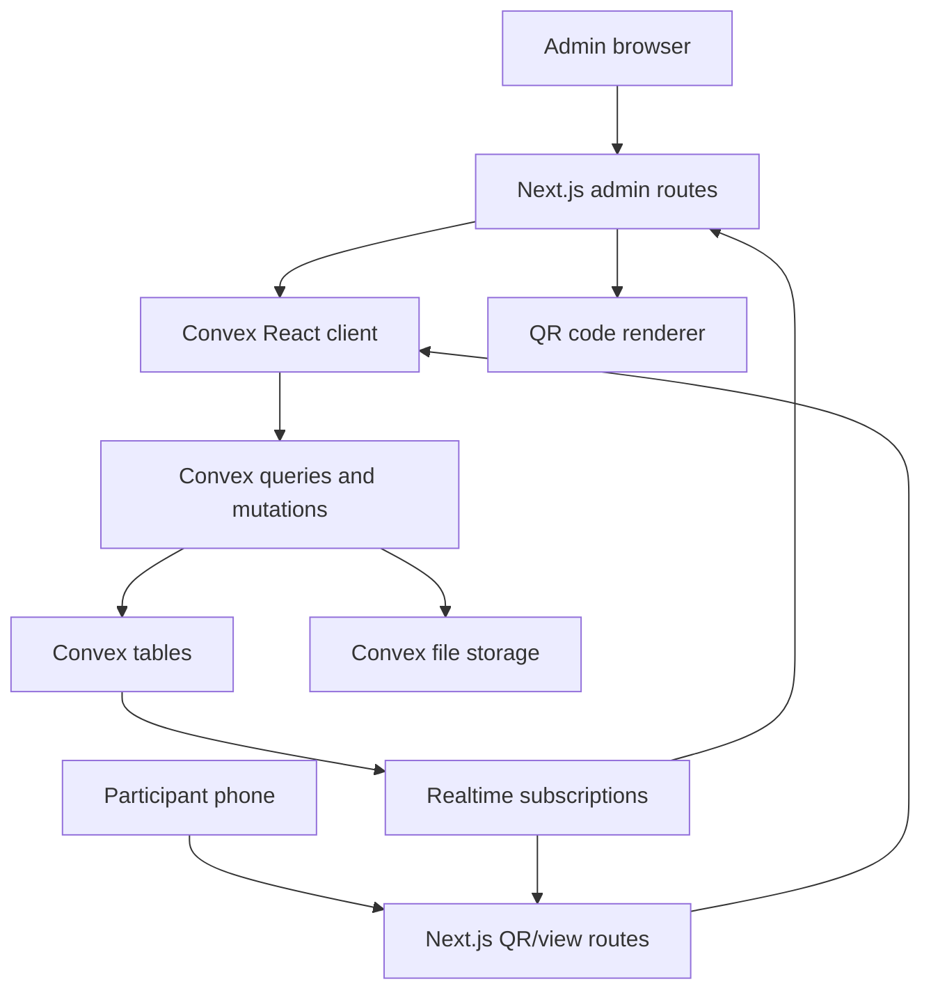

# Tommie Bachelor Party Tracker Web App Plan

## Goal Capsule

| Field | Value |
|---|---|
| Objective | Build a realtime web app for tracking the bachelor party game from `spel-tracking-spec.md`, with admin score entry and QR-token read-only participant access. |
| Platform | Next.js frontend hosted on Vercel, Convex realtime database and server functions. |
| Auth posture | No user accounts for participants. Participants access view-only pages through QR links containing opaque tokens. Admin access uses a basic passcode/session model sufficient for a private event. |
| Game posture | Physical card drawing remains offline. The app records the cards that were physically drawn and applies points/date state. |
| Stop conditions | Do not add random card drawing, payment handling, public sign-up, or production-grade identity unless requested later. |

---

## Product Contract

### Summary

The app is a live event tracker for the "Wie wordt de vrouw van Tommie" bachelor party game. Hosts create participants, assign pictures and teams, enter physical card draws and challenge results, and track Tommie's honeymoon money progress. Participants scan QR codes to open a read-only realtime view without creating accounts.

### Problem Frame

The game has enough state that a spreadsheet or paper score sheet will be error-prone during a party: individual points, per-player date eligibility, team-based reward distribution, Tommie's money target, and physical card draw results all interact. The tracker should make host entry fast and forgiving while giving participants a live scoreboard they can view from their phones.

### Actors

- A1. Admin host: creates participants, assigns pictures, enters results, corrects mistakes, and controls game state.
- A2. Participant: scans a QR code and views leaderboard, personal state, date eligibility, recent activity, and Tommie's money progress.
- A3. Tommie: appears as the subject of the game and has a separate money track, but does not need a special app account for MVP.

### Requirements

- R1. The app must use Convex as the realtime source of truth for participants, teams, game events, settings, and live score state.
- R2. The frontend must be deployable on Vercel as a Next.js application.
- R3. Admins must be able to create and edit participants with names and pictures.
- R4. Admins must be able to assign participants to teams for quiz and mini-game reward entry.
- R5. Admins must be able to enter physical card draws for any participant by selecting card ranks.
- R6. Card draw entry must calculate points from the physical cards: `2-10` by face value, `A/J/Q/K` as 10 points and date cards.
- R7. A date card must set the player's `canDate` flag to `true`; multiple date cards in one draw must not create multiple flags.
- R8. Every participant must start with `canDate = true`.
- R9. Starting a date must consume `canDate` immediately, regardless of success or failure.
- R10. Successful dates must create a pending or immediate 3-card reward entry for that participant.
- R11. Admins must be able to enter quiz round team scores and apply floor-rounded tie reward redistribution from `spel-tracking-spec.md`.
- R12. Team rewards must apply per person: if a team earns 3 card draws, every player on the team receives 3 card draws.
- R13. Admins must be able to enter mini-game placements and apply configured per-person card draw rewards.
- R14. Admins must be able to record Tommie money events, including hidden quiz tasks, joker use, Tommie challenges, dates, Round 3 wins, and manual adjustments.
- R15. The participant view must be read-only and accessible through a QR-code URL with an opaque token, without user accounts.
- R16. Participant QR tokens must not grant admin mutation access.
- R17. The participant view must update realtime when scores, date eligibility, participant pictures, or Tommie money changes.
- R18. The app must keep an audit/event log of score-affecting actions and corrections.
- R19. Admins must be able to undo or correct common mistakes by adding reversal/correction events rather than silently editing history.
- R20. The system must expose configuration for Tommie's EUR 10,000 target and default payouts.

### Key Flows

- F1. Admin creates participant with picture
  - **Trigger:** Admin prepares the tracker before or during the event.
  - **Steps:** Admin opens participant management, enters name, uploads picture, saves participant, and receives a QR-token link.
  - **Outcome:** Participant exists with `points = 0`, `canDate = true`, photo metadata, and a valid read-only token.
  - **Covers:** R3, R8, R15

- F2. Participant scans QR code
  - **Trigger:** Participant scans a QR code printed or shown by the admin.
  - **Steps:** App validates token, stores token locally for convenience, and renders read-only live view.
  - **Outcome:** Participant can see live scores and their own date eligibility, but cannot mutate game state.
  - **Covers:** R15, R16, R17

- F3. Admin records physical card draw
  - **Trigger:** A player physically draws cards after a reward.
  - **Steps:** Admin selects player, activity reason, and card ranks; app calculates points and date-card effects.
  - **Outcome:** Player points and `canDate` update realtime; event log records the draw.
  - **Covers:** R5, R6, R7, R18

- F4. Admin starts and resolves date
  - **Trigger:** Eligible player goes on a Tommie Date.
  - **Steps:** Admin starts date, app consumes `canDate`, admin records task and outcome, successful date creates 3 reward card obligations or direct card entry.
  - **Outcome:** Date state is auditable and reward cards can restore `canDate` if date cards are drawn.
  - **Covers:** R9, R10, R18

- F5. Admin enters team round result
  - **Trigger:** Quiz round or mini-game ends.
  - **Steps:** Admin enters scores/placements, app calculates team rewards, creates per-player draw obligations, and admin resolves physical card draws.
  - **Outcome:** Team reward maps to individual card draw obligations and individual points.
  - **Covers:** R11, R12, R13

### Acceptance Examples

- AE1. Card draw with `["A", "7", "K"]`
  - **Given:** Player has 0 points and `canDate = false`.
  - **When:** Admin records physical cards `A`, `7`, and `K`.
  - **Then:** Player gains 27 points and `canDate` becomes `true`.
  - **Covers:** R6, R7

- AE2. Failed date consumes eligibility
  - **Given:** Player has `canDate = true`.
  - **When:** Admin starts a date and marks it failed.
  - **Then:** Player has `canDate = false` and receives no automatic card reward.
  - **Covers:** R9, R10

- AE3. Two-way quiz tie for first
  - **Given:** Three teams finish a quiz round with Team A and Team B tied first, Team C third.
  - **When:** Admin applies quiz rewards.
  - **Then:** Team A receives 2 card draws per player, Team B receives 2 card draws per player, Team C receives 1 card draw per player.
  - **Covers:** R11, R12

- AE4. Participant token cannot mutate
  - **Given:** Participant has a valid QR token.
  - **When:** The participant attempts to call admin-only mutations from the browser.
  - **Then:** Convex rejects the action because the token authorizes only read/view scope.
  - **Covers:** R15, R16

### Scope Boundaries

Deferred for later:

- Physical QR code PDF generation or printable badge layouts.
- Full-blown user accounts through Clerk/Auth0/Google.
- Multi-event support across several bachelor parties.
- Random digital deck simulation.
- Offline-first mode for bad mobile reception.

Outside this product's identity:

- Payment processing or real money settlement.
- Public signup or anonymous internet participation.
- Social posting or public sharing.

### Sources

- Origin rules: `spel-tracking-spec.md`
- Convex Next.js quickstart: https://docs.convex.dev/quickstart/nextjs
- Convex authentication docs: https://docs.convex.dev/auth
- Convex file storage docs: https://docs.convex.dev/file-storage
- Convex Vercel hosting docs: https://docs.convex.dev/production/hosting/vercel
- Vercel environment variables docs: https://vercel.com/docs/environment-variables

---

## Planning Contract

### Key Technical Decisions

- KTD1. Use Next.js App Router plus Convex React client for realtime UI. This matches the Vercel hosting target and keeps participant/admin views in one deployable frontend.
- KTD2. Keep game rules in pure TypeScript helpers under `src/lib/game-rules.ts`. Convex mutations should call the same helpers as unit tests so card scoring, date flags, and tie redistribution stay deterministic.
- KTD3. Use Convex tables as the event source plus denormalized current state. `events` preserve auditability; `participants.points`, `participants.canDate`, and `settings.tommieMoney` make live dashboards simple and fast.
- KTD4. Use opaque QR tokens for participants. Store only token hashes in Convex, put the raw token in the QR URL, and authorize view-only queries by validating the token hash.
- KTD5. Use a basic admin passcode/session for MVP. The admin flow can issue an admin session token and require it for Convex mutations; this avoids participant accounts and keeps implementation small for a private event.
- KTD6. Use Convex file storage for participant pictures. Keeping images in Convex avoids adding Vercel Blob or another storage provider for MVP.
- KTD7. Record physical cards, do not simulate the deck. Admins enter ranks after the real draw, and the app calculates state changes.
- KTD8. Use correction events instead of destructive edits. Corrections preserve party-day accountability and make undo flows recoverable.

### High-Level Technical Design

### Planned Project Shape

The folder currently has no app scaffold. The implementation should create a new app at the project root:

| Path | Purpose |
|---|---|
| `package.json` | Scripts and dependencies for Next.js, Convex, QR rendering, tests, and linting. |
| `next.config.ts` | Next.js config for Vercel deployment. |
| `src/app/page.tsx` | Redirect or public landing route for token entry. |
| `src/app/admin/page.tsx` | Admin dashboard. |
| `src/app/admin/login/page.tsx` | Basic admin passcode login. |
| `src/app/admin/participants/page.tsx` | Participant creation, editing, pictures, and QR links. |
| `src/app/admin/scoring/page.tsx` | Card draw, date, quiz, mini-game, and Tommie money entry. |
| `src/app/p/[token]/page.tsx` | Participant read-only QR route. |
| `src/components/admin/*` | Admin form and scoring components. |
| `src/components/viewer/*` | Participant scoreboard and personal state components. |
| `src/lib/game-rules.ts` | Pure scoring/date/tie calculation helpers. |
| `src/lib/tokens.ts` | Token generation and hashing helpers safe for server/Convex usage. |
| `convex/schema.ts` | Convex table schema. |
| `convex/participants.ts` | Participant queries/mutations and photo metadata. |
| `convex/authTokens.ts` | Participant token validation and admin session helpers. |
| `convex/scoring.ts` | Card draw, date, quiz, mini-game, and correction mutations. |
| `convex/settings.ts` | Tommie target and payout configuration. |
| `convex/files.ts` | Upload URL and participant photo storage helpers. |
| `tests/game-rules.test.ts` | Pure rule coverage. |
| `tests/auth-tokens.test.ts` | Token hashing and authorization behavior. |
| `tests/scoring-flows.test.ts` | Convex mutation flow tests or integration-style rule orchestration tests. |

### Convex Data Model

| Table | Important fields | Notes |
|---|---|---|
| `participants` | `name`, `photoStorageId`, `points`, `canDate`, `currentTeamId`, `createdAt`, `isActive` | Current score state lives here for realtime views. |
| `teams` | `name`, `color`, `participantIds`, `activityId`, `createdAt` | Teams can be reused or activity-specific. |
| `participantTokens` | `participantId`, `tokenHash`, `revokedAt`, `createdAt`, `lastUsedAt` | Raw QR token is shown once and never stored. |
| `adminSessions` | `tokenHash`, `createdAt`, `expiresAt`, `revokedAt` | Basic admin session gate for mutations. |
| `settings` | `tommieTarget`, `tommieMoney`, `defaultPayouts`, `updatedAt` | Single event settings document is enough for MVP. |
| `events` | `type`, `actor`, `participantId`, `teamId`, `payload`, `pointsDelta`, `moneyDelta`, `createdAt`, `reversesEventId` | Append-only audit log. |
| `drawObligations` | `participantId`, `activityType`, `activityId`, `cardCount`, `status`, `createdAt`, `resolvedEventId` | Lets team rewards create pending per-person physical card draws. |
| `activities` | `type`, `name`, `status`, `metadata`, `createdAt` | Optional but useful for grouping quiz rounds and mini-games. |

### Sequencing

1. Scaffold the app and Convex project.
2. Implement pure game rule helpers and tests before wiring UI.
3. Implement Convex schema and core mutations.
4. Add participant QR token auth and read-only queries.
5. Build admin participant/photo management.
6. Build admin scoring workflows.
7. Build participant realtime view.
8. Deploy to Vercel and connect Convex production environment variables.

### Assumptions

- The implementation can start from an empty app scaffold in this folder.
- Admin auth only needs to protect a private party admin interface, not satisfy enterprise identity requirements.
- Participant QR tokens can be long-lived for the event and revocable by the admin.
- Participant pictures are uploaded through the admin UI, not by participants.
- Realtime read views can show all participants' scores; the token identifies the viewer primarily to highlight their own state.

---

## Implementation Units

### U1. App Scaffold and Deployment Baseline

- **Goal:** Create the Next.js and Convex baseline that can run locally and deploy to Vercel.
- **Requirements:** R1, R2
- **Files:** `package.json`, `next.config.ts`, `src/app/layout.tsx`, `src/app/page.tsx`, `convex/_generated/*`, `convex/schema.ts`, `.env.example`, `README.md`
- **Approach:** Initialize a TypeScript Next.js App Router app, add Convex, configure provider wiring in the root layout, and document required environment variables.
- **Test Scenarios:**
  - `npm run build` succeeds with Convex generated types present.
  - Local development can connect to Convex using documented `.env.local` values.
  - Vercel build does not require local-only files.
- **Verification:** `npm run lint`, `npm run build`

### U2. Pure Game Rule Engine

- **Goal:** Implement deterministic helpers for card scoring, date state, quiz tie redistribution, and per-person team reward expansion.
- **Requirements:** R5, R6, R7, R8, R9, R10, R11, R12
- **Files:** `src/lib/game-rules.ts`, `tests/game-rules.test.ts`
- **Approach:** Keep all domain calculations independent from React and Convex so tests can cover edge cases quickly.
- **Test Scenarios:**
  - Number cards return face-value points and do not alter `canDate`.
  - `A/J/Q/K` each return 10 points and set `canDate = true`.
  - Multiple date cards stack points but only produce one true date flag.
  - Starting a date consumes `canDate` for success and failure flows.
  - Quiz no-tie reward is `3 / 2 / 1`.
  - Three-way tie reward is `2 / 2 / 2`.
  - Two-way tie for first reward is `2 / 2 / 1`.
  - Two-way tie for second reward is `3 / 1 / 1`.
  - Team reward expansion creates one draw obligation per participant.
- **Verification:** `npm test -- tests/game-rules.test.ts`

### U3. Convex Schema and Event-Sourced Mutations

- **Goal:** Create Convex tables and mutation/query boundaries for participants, settings, events, draw obligations, and score state.
- **Requirements:** R1, R5, R6, R7, R8, R14, R18, R19, R20
- **Files:** `convex/schema.ts`, `convex/participants.ts`, `convex/scoring.ts`, `convex/settings.ts`, `tests/scoring-flows.test.ts`
- **Approach:** Mutations append an `events` record and update denormalized participant/settings state in one transaction. Corrections create reversal events instead of deleting history.
- **Test Scenarios:**
  - Creating a participant initializes `points = 0` and `canDate = true`.
  - Recording a card draw updates participant points and appends a `card_draw` event.
  - Recording a date-card draw updates `canDate = true`.
  - Recording Tommie money updates settings and appends a `tommie_money` event.
  - Reversing an event creates a correction event and updates current state consistently.
- **Verification:** `npm test -- tests/scoring-flows.test.ts`

### U4. Token Auth for Participants and Admin

- **Goal:** Implement no-account read-only QR access for participants and basic admin authorization for mutations.
- **Requirements:** R15, R16, R17
- **Files:** `src/lib/tokens.ts`, `convex/authTokens.ts`, `src/app/admin/login/page.tsx`, `src/app/p/[token]/page.tsx`, `tests/auth-tokens.test.ts`
- **Approach:** Generate cryptographically strong opaque tokens, store only hashes in Convex, validate participant tokens for read-only queries, and gate admin mutations through admin session tokens.
- **Test Scenarios:**
  - Raw participant token validates against stored hash.
  - Invalid or revoked token is rejected.
  - Participant token cannot call admin-scoped mutations.
  - Admin session expires according to configured TTL.
  - QR route with a valid token renders viewer shell; invalid token renders an access error.
- **Verification:** `npm test -- tests/auth-tokens.test.ts`

### U5. Participant Management and Photo Uploads

- **Goal:** Build admin UI for participant CRUD, pictures, team assignment, and QR link display.
- **Requirements:** R3, R4, R8, R15
- **Files:** `src/app/admin/participants/page.tsx`, `src/components/admin/ParticipantForm.tsx`, `src/components/admin/ParticipantTable.tsx`, `src/components/admin/QRCodePanel.tsx`, `convex/files.ts`, `convex/participants.ts`
- **Approach:** Use Convex upload URLs for photos, store `photoStorageId` on participants, and render QR codes from participant token URLs.
- **Test Scenarios:**
  - Admin creates participant with name only.
  - Admin uploads participant picture and the photo appears in admin and viewer UI.
  - Admin regenerates or revokes participant QR token.
  - Admin assigns participant to a team and the assignment appears in scoring flows.
- **Verification:** Component tests for form behavior plus manual local QA with Convex dev data.

### U6. Admin Scoring Workflows

- **Goal:** Build host-facing workflows for card draws, dates, quiz rounds, mini-games, Tommie money, and corrections.
- **Requirements:** R5, R6, R7, R9, R10, R11, R12, R13, R14, R18, R19, R20
- **Files:** `src/app/admin/scoring/page.tsx`, `src/components/admin/CardDrawForm.tsx`, `src/components/admin/DateFlow.tsx`, `src/components/admin/QuizRoundForm.tsx`, `src/components/admin/MiniGameForm.tsx`, `src/components/admin/TommieMoneyForm.tsx`, `convex/scoring.ts`, `convex/settings.ts`
- **Approach:** Optimize for fast party-day entry: large controls, minimal typing, visible pending draw obligations, and clear confirmation before correction events.
- **Test Scenarios:**
  - Admin records a direct card draw and sees points update.
  - Admin starts a date and the player disappears from eligible-date list.
  - Admin marks date success and receives a pending 3-card obligation.
  - Admin enters quiz scores with a two-way tie and sees floor-rounded rewards.
  - Admin applies mini-game placements and creates per-person draw obligations.
  - Admin records Tommie money event and progress updates.
  - Admin corrects a mistaken card draw through a reversal event.
- **Verification:** Unit/integration tests for mutation behavior plus browser QA of each admin form.

### U7. Participant Realtime Viewer

- **Goal:** Build mobile-friendly read-only views for participants.
- **Requirements:** R15, R16, R17
- **Files:** `src/app/p/[token]/page.tsx`, `src/components/viewer/Leaderboard.tsx`, `src/components/viewer/ParticipantStatus.tsx`, `src/components/viewer/TommieProgress.tsx`, `src/components/viewer/RecentEvents.tsx`, `convex/viewer.ts`
- **Approach:** Token-authenticated queries return only viewer-appropriate data and subscribe realtime to leaderboards, date flags, participant pictures, and recent events.
- **Test Scenarios:**
  - Valid QR token renders live leaderboard.
  - Viewer sees their own name/photo/date state highlighted.
  - Viewer cannot see admin controls.
  - Viewer updates after admin records a card draw without refresh.
  - Revoked token loses access on refresh or next query cycle.
- **Verification:** Browser QA on mobile viewport and desktop viewport.

### U8. Production Deployment and Operational Polish

- **Goal:** Make the app deployable and usable during the event.
- **Requirements:** R2, R15, R20
- **Files:** `.env.example`, `README.md`, `docs/operations/event-runbook.md`, `vercel.json` if needed
- **Approach:** Document environment setup, Convex deployment, Vercel environment variables, admin passcode rotation, QR URL base, and fallback procedure if Wi-Fi is weak.
- **Test Scenarios:**
  - Fresh clone/setup instructions produce a working local dev app.
  - Vercel preview deployment points at the intended Convex deployment.
  - Production admin passcode and token secrets are not committed.
  - Event runbook explains how to create participants, print/show QR codes, enter card draws, and correct mistakes.
- **Verification:** Vercel preview smoke test, production env review, runbook dry run.

---

## Verification Contract

| Check | Command or method | Covers |
|---|---|---|
| Typecheck | `npm run typecheck` | U1-U8 |
| Lint | `npm run lint` | U1-U8 |
| Unit tests | `npm test` | U2, U4 |
| Convex/scoring tests | `npm test -- tests/scoring-flows.test.ts` | U3, U6 |
| Build | `npm run build` | U1, U5-U8 |
| Local realtime QA | Run Next.js and Convex locally, open admin and participant QR pages in two browsers, verify live updates. | U5-U7 |
| Mobile viewport QA | Browser test `/p/[token]` at phone dimensions for leaderboard, date state, and Tommie progress. | U7 |
| Deployment smoke test | Deploy Vercel preview connected to Convex deployment and create one participant, one card draw, one viewer QR session. | U8 |

The scaffold should define the exact scripts. Recommended scripts are `dev`, `convex:dev`, `typecheck`, `lint`, `test`, and `build`.

---

## Definition of Done

- Product behavior from `spel-tracking-spec.md` is represented in the app or explicitly deferred.
- Admin can create participants with pictures and QR links.
- Participant QR view is read-only, token-gated, and realtime.
- Admin can enter physical card draws and the app applies points/date cards correctly.
- Admin can start dates, consume `canDate`, record outcomes, and handle successful date rewards.
- Admin can enter quiz and mini-game results that produce per-person draw obligations.
- Admin can track Tommie's money toward EUR 10,000 and configure default payouts.
- Event log captures score-affecting changes and corrections.
- Vercel deployment has documented environment variables and Convex production linkage.
- Tests cover card scoring, date state, tie redistribution, token validation, and core scoring mutations.
- Abandoned experimental code and unused scaffold artifacts are removed before delivery.

---

## Appendix

### Environment Variables

| Variable | Used by | Purpose |
|---|---|---|
| `NEXT_PUBLIC_CONVEX_URL` | Next.js client | Convex deployment URL. |
| `CONVEX_DEPLOYMENT` | Convex/Vercel setup | Convex deployment identifier where required by tooling. |
| `ADMIN_PASSCODE_HASH` | Admin login | Hash of event admin passcode. |
| `ADMIN_SESSION_SECRET` | Auth/session helpers | Secret for admin session token hashing/signing. |
| `PARTICIPANT_TOKEN_SECRET` | QR token helpers | Secret or salt for participant token hashing. |
| `NEXT_PUBLIC_APP_URL` | QR rendering | Base URL for generated participant QR links. |

### Recommended Dependencies

| Dependency | Reason |
|---|---|
| `convex` | Realtime database and server functions. |
| `next`, `react`, `react-dom` | Vercel-hosted frontend. |
| `qrcode` or equivalent React QR package | Render participant QR links in admin UI. |
| `vitest` | Fast rule and token tests. |
| `@testing-library/react` | Component behavior tests where useful. |

